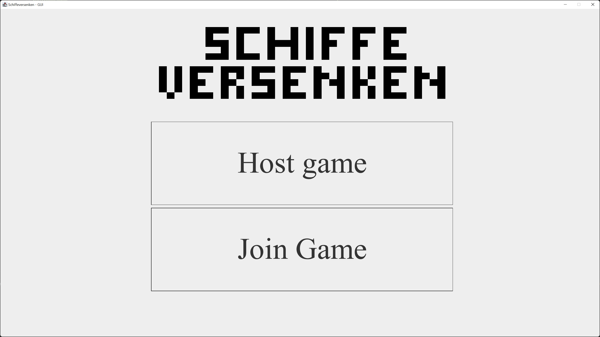
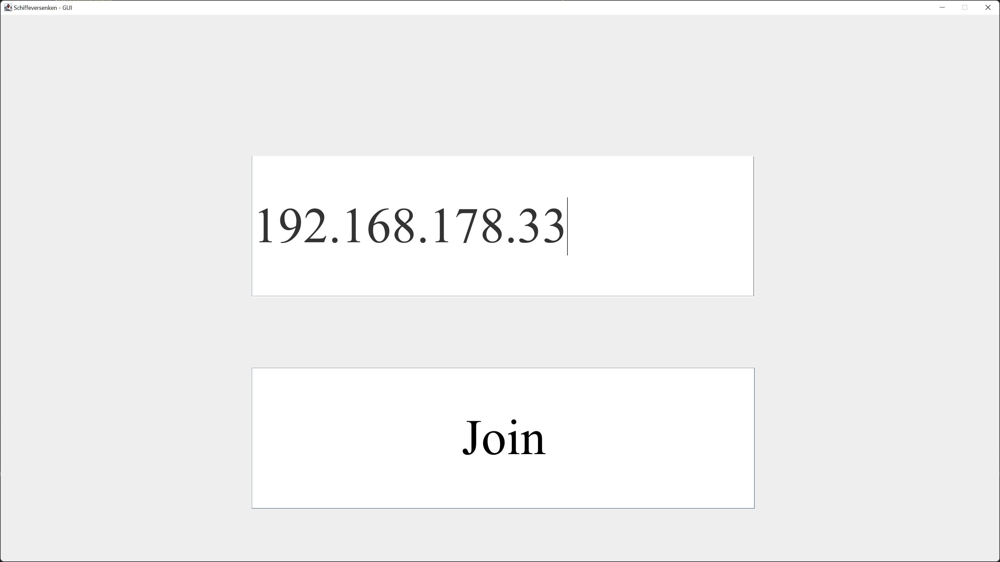
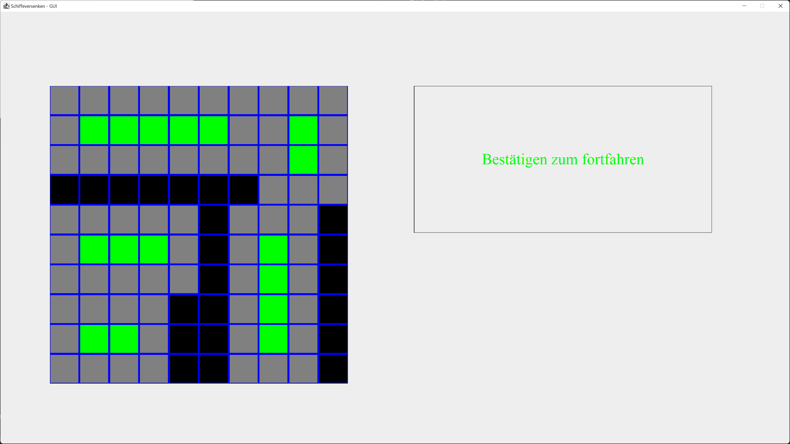
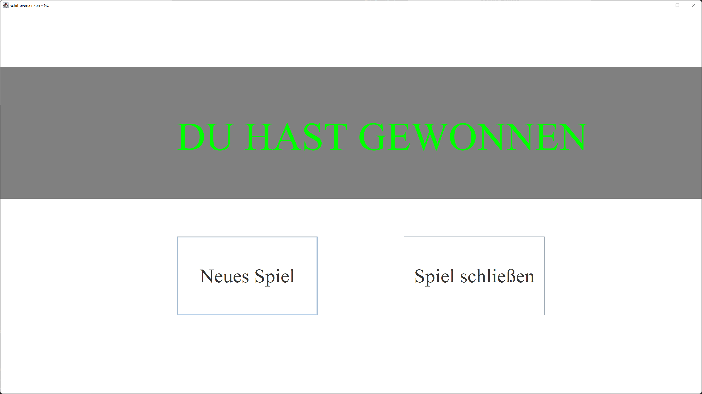
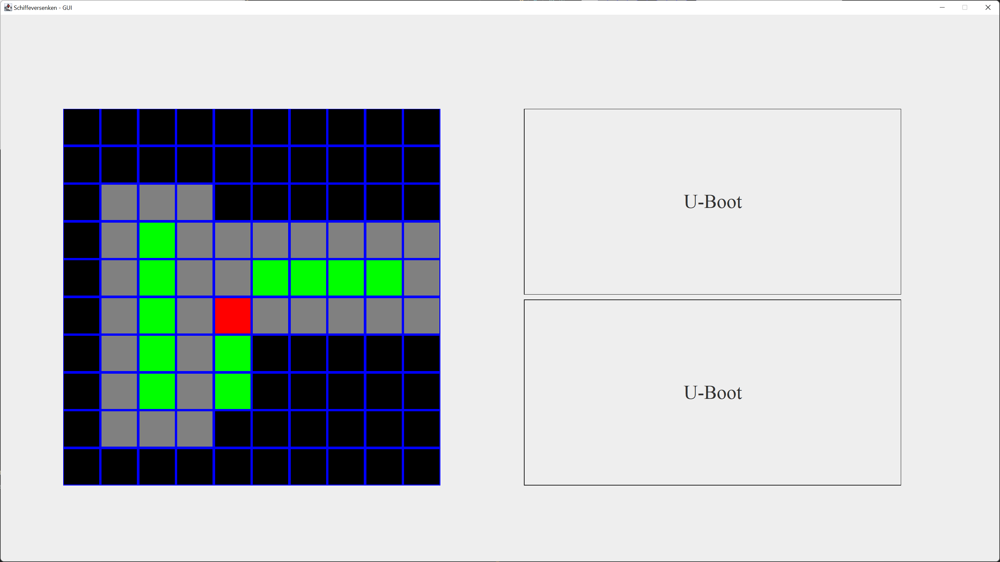
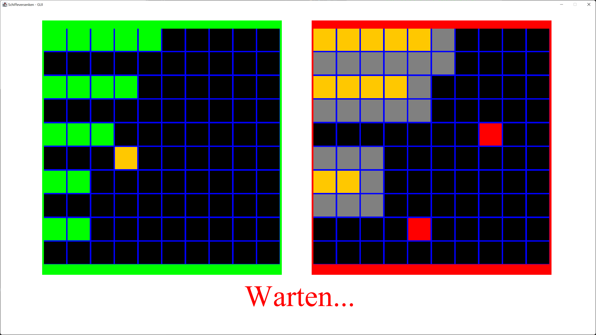

# SchiffeVersenken
## Getting started

Wichtig: Das Spiel funktioniert nur im Lokalen netzwerk

- Main klasse oder Jar datei starten
- Wählen man selbst das Spiel hosten oder einem bestehenden Host beitreten möchte
  - Der Host startet automatisch einen neuen Thread mit dem Server und verbindet sich selbst damit
  - Der Client muss die IP adresse des Servers, mit dem er sich verbinden will angeben
- Die Schiffe platzieren
- Zum Bestätigen auf bereit drücken
- Der Gast (nicht der Host) darf immer den ersten Zug machen
- Jeder Spieler ist so lange an der Reihe, wie er Felder auf denen Schiffe liegen getroffen hat
- Verfehlt der Spieler einen Schuss, ist der andere Spieler dran
- Wenn alle Schiffe eines Spielers versenkt wurden gelangt man zum Gewinn-bildschirm
- entscheiden, ob man das Spiel neu starten oder schließen möchte

Startbildschirm:

Joinbildschirm:

Spielbildschirm:

Gewinnbildschirm: 

## Steuerung

### Generelles:
- Alle Interaktionen werden mit der Maus durchgeführt.
- Eingaben in Textfelder oder ähnliches werden mit der Tastatur durchgeführt.

### Platzierung der Schiffe:
- Erst muss man mit der Maus einen der Knöpfe am rechten Rand des Spielfensters auswählen
- Anschließend muss man die Maus über das Spielfeld bewegen (Die Maustaste darf nicht gedrückt gehalten werden)
- Das Spiel zeigt einem eine Vorschau, wo das Schiff platziert wird.
- Ist die Vorschau grün, kann es hier platziert werden.
- Ist die Vorschau rot, kann es hier nicht platziert werden
- Um seine Eingabe zu bestätigen, muss man erneut auf das Spielfeld klicken.
- Wenn man die Richtung des Schiffs ändern möchte, muss man ein Rechtsklick in das Feld machen, auch die Vorschau wird sich verändern.
- Wenn alle Schiffe platziert sind, erscheint ein Knopf, mit dem man seine Platzierung bestätigen kann.
- Wenn das Spiel ein Fehler in der Platzierung erkennt, bekommt der Spieler eine Rückmeldung und muss seine Schiffe neu platzieren.

### Schießen auf das gegnerische Feld:
- Das linke Feld ist das eigene Feld
- Das rechte Feld ist das Feld des gegners
- Am unteren Bildschirmrand wird angezeigt, wer gerade an der Reihe ist
- Wenn man an der Reihe ist, muss man nur ein Feld des Gegners anklicken um darauf zu schießen.
- Treffer werden orange markiert
- Verfehlungen werden rot markiert
- Wird ein Schiff komplett versenkt, erscheint ein grauer Rahmen darum.

## Lokale Simulation von zwei spielern auf einem Gerät
Möchte man eine Mehrspieler erfahrung auf einem Gerät simulieren, kann man einfach die Main klasse in zwei verschiedenen
Run-Konfigurationen laufen lassen und das Spiel wie gewohnt ausführen.